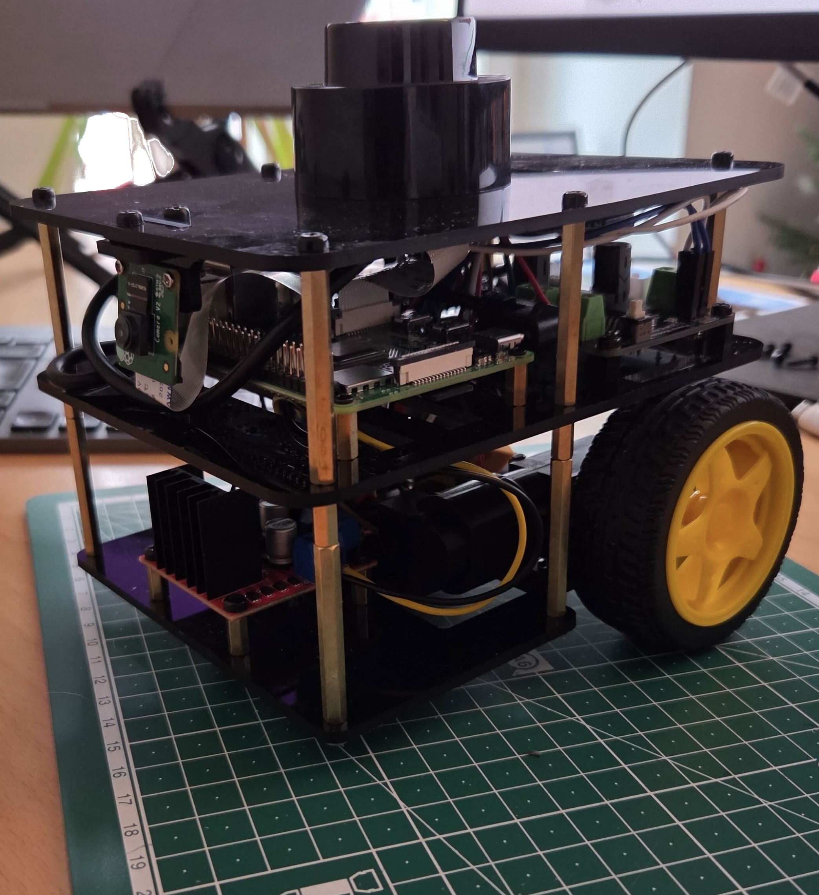

# Fastbot ROS2

[](https://docs.ros.org/en/humble/)
[](https://opensource.org/licenses/MIT)
[](https://www.raspberrypi.org/)

A ROS2 workspace for the Fastbot mobile robot platform with differential drive, LiDAR sensor integration, and Gazebo simulation support.

<p align="center">
  
  
</p>

## Table of Contents

- [Overview](#overview)
- [Credits](#-credits)
- [Packages](#packages)
- [Documentation](#documentation)
- [Quick Start](#quick-start)
- [Additional Usage](#additional-usage)
- [Build Guide](#build-guide)
- [License](#license)

## Overview

This repository contains ROS2 packages for controlling and simulating the Fastbot robot. The project includes robot description files, hardware drivers, simulation environments, and launch configurations.

---

## 🎓 Credits

**This project is inspired by [The Construct's FastBot](https://www.theconstruct.ai/fastbot/)** - an open-source ROS 2 robot kit for hands-on robotics learning.
Want to learn ROS 2 and robotics? Check out [The Construct's courses](https://www.theconstruct.ai/) for comprehensive hands-on training.

This repository provides the complete ROS 2 software stack for building and programming your own FastBot robot. 🤖

---

## Packages

### fastbot_description

Robot description package containing URDF/Xacro files and 3D models for the Fastbot platform.

- URDF/Xacro robot models
- 3D meshes and visual models
- OnShape CAD integration

### fastbot_bringup

Launch configurations to bring up the Fastbot robot with all sensors and actuators.

- System-level launch files
- Hardware initialization
- Sensor and actuator startup

### fastbot_gazebo

Gazebo simulation environment for the Fastbot robot.

- Gazebo world files
- Simulation models
- Simulated sensor configurations

### serial_motor

Python package for differential drive control via serial communication.

- Serial motor driver node
- Differential drive kinematics
- Motor control interface

### serial_motor_msgs

Custom ROS2 message definitions for serial motor communication.

- Motor command messages
- Motor status messages

### Lslidar_ROS2_driver

ROS2 driver for Leishen LiDAR sensors.

- LiDAR data acquisition
- LiDAR configuration

## Documentation

The `docs/` directory contains build guides and hardware documentation:

- **[Build Guide](docs/build_guide/)** - Step-by-step robot build evolution
- **[Hardware](docs/hardware/)** - Physical components and fabrication files (3D printing, etc.)

See the [documentation README](docs/README.md) for more details.

## Quick Start

### 1. Raspberry Pi Setup

Install Ubuntu Server 22.04 LTS on your Raspberry Pi (4 or 5 recommended).

Install ROS2 Humble:

```bash
# Add ROS2 repository
sudo apt update && sudo apt install -y software-properties-common
sudo add-apt-repository universe
sudo apt update && sudo apt install -y curl
sudo curl -sSL https://raw.githubusercontent.com/ros/rosdistro/master/ros.key -o /usr/share/keyrings/ros-archive-keyring.gpg
echo "deb [arch=$(dpkg --print-architecture) signed-by=/usr/share/keyrings/ros-archive-keyring.gpg] http://packages.ros.org/ros2/ubuntu $(. /etc/os-release && echo $UBUNTU_CODENAME) main" | sudo tee /etc/apt/sources.list.d/ros2.list > /dev/null

# Install ROS2 Humble
sudo apt update
sudo apt install -y ros-humble-ros-base ros-humble-demo-nodes-cpp ros-humble-teleop-twist-keyboard ros-humble-rmw-cyclonedds-cpp ros-humble-joint-state-publisher
sudo apt install -y ros-dev-tools git-all

# Add to .bashrc
echo "source /opt/ros/humble/setup.bash" >> ~/.bashrc
source ~/.bashrc
```

### 2. Arduino Setup

Flash the Arduino Nano with ros_arduino_bridge firmware:

1. Download [ros_arduino_bridge](https://github.com/hbrobotics/ros_arduino_bridge)
2. Open `ROSArduinoBridge.ino` in Arduino IDE
3. Configure encoder pins and motor driver pins in `encoder_driver.h` and `motor_driver.h`
4. Upload to Arduino Nano

Set up udev rules for consistent device naming:

```bash
# Find Arduino identifiers
udevadm info -a -n /dev/ttyUSB0 | grep '{idVendor}\|{idProduct}'

# Create udev rule
sudo nano /etc/udev/rules.d/99-arduino.rules

# Add this line (adjust idVendor and idProduct as needed):
SUBSYSTEM=="tty", ATTRS{idVendor}=="1a86", ATTRS{idProduct}=="7523", SYMLINK+="arduino_nano"

# Reload udev rules
sudo udevadm control --reload-rules
sudo udevadm trigger
```

### 3. Install Dependencies

Install all required libraries for LiDAR, camera, and motor control:

```bash
# LiDAR dependencies
sudo apt install -y \
    libboost-all-dev \
    libpcl-dev \
    libpcap-dev \
    ros-humble-diagnostic-updater \
    ros-humble-pcl-conversions

# Camera dependencies
sudo apt install -y \
    ros-humble-v4l2-camera \
    ros-humble-image-transport-plugins \
    v4l-utils
```

### 4. Configure Raspberry Pi Camera

Enable legacy camera driver for compatibility with ros2_v4l2_camera:

```bash
sudo nano /boot/firmware/config.txt
```

Set `camera_autodetect=0` and add `start_x=1` at the end:

```
camera_autodetect=0

# Enable camera (legacy driver)
start_x=1
```

Reboot after changes:

```bash
sudo reboot
```

### 5. Clone and Build

Clone this repository into your ROS2 workspace:

```bash
# Create ROS2 workspace
mkdir -p ~/ros2_ws/src
cd ~/ros2_ws/src

# Clone the repository
git clone <repository-url> fastbot_ros2

# Build the workspace
cd ~/ros2_ws
colcon build --symlink-install
source install/setup.bash
```

### 6. Launch the Robot

Launch the complete system with all sensors and motors:

```bash
ros2 launch fastbot_bringup bringup.launch.xml
```

This will start:

- Serial motor driver (connects to `/dev/arduino_nano`)
- LSlidar N10 driver (connects to `/dev/lslidar`)
- Raspberry Pi camera
- All necessary transforms and configurations

## Additional Usage

### Visualization with RViz

After launching the robot with bringup, you can visualize the robot in RViz:

```bash
# First, launch the robot bringup (in one terminal)
ros2 launch fastbot_bringup bringup.launch.xml

# Then, launch RViz for visualization (in another terminal)
ros2 launch fastbot_description display.launch.py
```

The RViz display will show:

- Robot model with real-time joint states
- TF frames
- LiDAR scan data
- Camera image feed

### Gazebo Simulation

Launch Gazebo simulation:

```bash
ros2 launch fastbot_gazebo one_fastbot_warehouse.launch.py
```

### Teleoperation

Control the robot with keyboard:

```bash
ros2 run teleop_twist_keyboard teleop_twist_keyboard --ros-args --remap cmd_vel:=/fastbot/cmd_vel
```

### Individual Components

Launch components separately if needed:

```bash
# Motor control only
ros2 run serial_motor serial_motor_node

# LiDAR only
ros2 launch lslidar_driver lslidar_launch.py

# Camera only
ros2 run v4l2_camera v4l2_camera_node
```

## Build Guide

For detailed step-by-step instructions on building the robot from scratch, see the [Build Guide](docs/build_guide/). The build guide shows the incremental evolution of the robot:

1. Basic motor control setup (Arduino + motors + encoders)
2. Power module integration
3. Raspberry Pi integration
4. LiDAR sensor addition
5. Camera integration

## License

This project is licensed under the MIT License - see the [LICENSE](LICENSE) file for details.

## Maintainer

Dmitri Manajev
