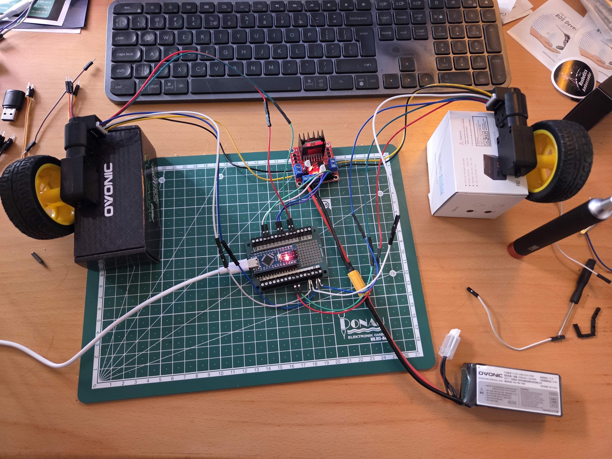

# Step 1: Basic Motor Control Setup

This is the foundation of the Fastbot - a simple differential drive robot controlled via Arduino and ROS.

## Hardware Components

### Required Parts

1. **Arduino Microcontroller** (Nano or compatible)
2. **2x TT DC Motors with Encoders**
   - [Yahboom Encoder TT Motor](https://category.yahboom.net/products/encoder-tt-motor?variant=39554242412628)
   - 6V DC motors with built-in encoders
3. **L298N Motor Driver**
   - Dual H-bridge motor driver
   - Can drive 2 DC motors
   - Built-in 5V regulator
4. **Power Supply**
   - 7-12V battery pack for motors (in my case ovonic 2200mAh 11.1V)
   - USB power for Arduino
5. **Jumper Wires**

## Wiring



### L298N to Arduino Connections

| L298N Pin | Arduino Pin  | Description                    |
| --------- | ------------ | ------------------------------ |
| IN1       | D10          | Left motor direction forward   |
| IN2       | D6           | Left motor direction backward  |
| IN3       | D5(opposite) | Right motor direction forward  |
| IN4       | D9(opposite) | Right motor direction backward |

**Note**: "opposite" means the wiring is swapped in the Arduino code - the forward pin connects to the backward control in code, and vice versa. This is done to account for the right motor being mounted in reverse orientation.

### Motor Encoder Connections

| Encoder Pin           | Arduino Pin  | Description        |
| --------------------- | ------------ | ------------------ |
| Left motor Encoder A  | D2           | Interrupt pin      |
| Left motor Encoder B  | D3           | Direction sensing  |
| Right motor Encoder A | A5(opposite) | Interrupt pin      |
| Right motor Encoder B | A4(opposite) | Direction sensing  |
| Encoder VCC           | 5V           | Power for encoders |
| Encoder GND           | GND          | Ground             |

**Note**: "opposite" means the wiring is swapped in the Arduino code - encoder A wire connects to the B pin in code, and encoder B wire connects to the A pin in code. This is done to account for the right motor being mounted in reverse orientation.

### Power Connections

1. Connect battery pack (+) to L298N 12V input
2. Connect battery pack (-) to L298N GND
3. Connect motors to L298N motor outputs (OUT1/OUT2 for left motor, OUT3/OUT4 for right motor (always first +, second -))

## Software Setup

### 1. Setup Arduino Firmware

The ros_arduino_bridge provides Arduino firmware that turns your Arduino into a motor controller with a serial interface. This allows a higher-level computer (like a Raspberry Pi running ROS) to communicate with the Arduino to control motors and read encoders.

**Repository**: [https://github.com/joshnewans/ros_arduino_bridge](https://github.com/joshnewans/ros_arduino_bridge)

```bash
# Clone the repository
git clone https://github.com/joshnewans/ros_arduino_bridge.git
```

### 2. Upload Arduino Sketch

1. Open the Arduino IDE
2. Navigate to the cloned repository and open `ROSArduinoBridge/ROSArduinoBridge.ino`
3. Upload to your Arduino Nano

**Note**: This firmware runs on the Arduino. Later, you'll connect this Arduino to a Raspberry Pi (or other computer) running ROS, which will send commands over serial to control the robot.

## Testing

### Serial Communication Test

Before running ROS, test the Arduino communication using a serial terminal.

**Using Serial Tool**: [https://serialtool.com/\_en/index.php](https://serialtool.com/_en/index.php)

1. Connect your Arduino via USB
2. Open Serial Tool in your browser
3. Configure the connection:
   - **Port**: Select the correct USB port (usually `/dev/ttyUSB0` or `/dev/ttyACM0` on Linux, `COM1` or similar on Windows)
   - **Baud Rate**: 57600
4. Click "Connect"

**Test Commands**:

- `e` - Read encoder values
- `r` - Reset encoders
- `o 100 100` - Move motors (open loop, direct PWM)
- `m 100 100` - Move motors (closed loop, PID control)

## Resources

- [ros_arduino_bridge Documentation](https://github.com/joshnewans/ros_arduino_bridge)
- [L298N Datasheet](https://www.sparkfun.com/datasheets/Robotics/L298_H_Bridge.pdf)
- [TT Motor Specifications](https://category.yahboom.net/products/encoder-tt-motor?variant=39554242412628)
