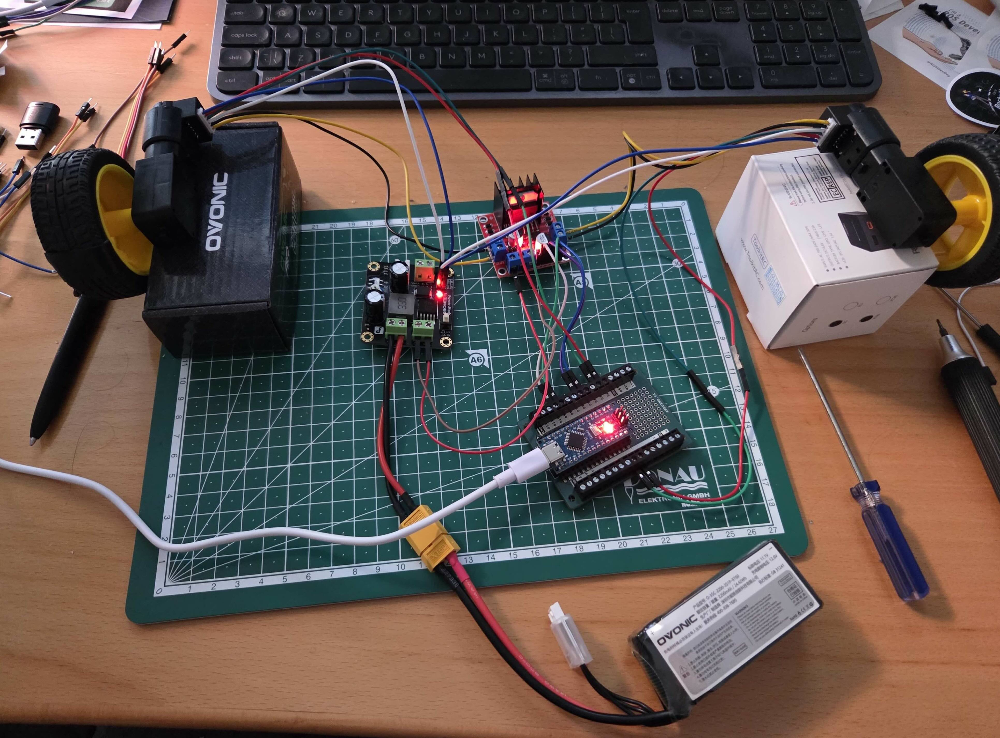

# Step 2: Add Power Module

This step simplifies power distribution by adding a dedicated power module to manage battery power for the motor driver and encoders.

## Hardware Components

### New Parts

1. **DFRobot DFR0205 Power Module**
   - Dual output: 5V and 3.3V
   - Input voltage: 6.5-12V
   - Provides stable regulated power
   - [Product Link](https://www.dfrobot.com/product-752.html)

## Why Add a Power Module?

The power module centralizes power distribution and provides several benefits:

- **Cleaner wiring** - Single power input from battery
- **Stable voltage** - Regulated 5V output for encoders
- **Simplified connections** - No need to power encoders from Arduino
- **Better power management** - Dedicated power rails for different components

## Wiring Changes

### Power Module Connections

| DFR0205 Pin    | Connection       | Description                      |
| -------------- | ---------------- | -------------------------------- |
| VIN (+)        | Battery positive | 11.1V input (7-12V range)        |
| GND (-)        | Battery negative | Ground                           |
| VOUT (+)       | L298N 12V input  | Pass-through battery voltage     |
| GND (-)        | L298N GND        | Pass-through ground              |
| 5V OUT (5, 7)  | Encoders VCC     | Regulated 5V output for encoders |
| GND OUT (6, 8) | Encoders GND     | Common ground for encoders       |

### Updated Encoder Connections

**Remove from Arduino**:

- Encoder VCC (was connected to Arduino 5V)
- Encoder GND (was connected to Arduino GND)

**Connect to DFR0205**:

| Encoder Pin | DFR0205 Pin | Description        |
| ----------- | ----------- | ------------------ |
| Encoder VCC | 5V OUT      | Power for encoders |
| Encoder GND | GND OUT     | Ground             |

### Updated Power Flow

1. Battery → DFR0205 VIN/GND (input)
2. DFR0205 VOUT/GND → L298N 12V input (pass-through full battery voltage)
3. DFR0205 5V OUT → Encoder VCC (regulated 5V)
4. DFR0205 GND OUT → Encoder GND (common ground)
5. Arduino powered via USB (unchanged)

**Note**: The DFR0205 acts as a power distribution hub - it passes full battery voltage to the L298N motor driver via VOUT, while providing regulated 5V to the encoders and other components. This eliminates the need for separate battery connections.

## Benefits

✅ **Cleaner setup** - Encoders no longer draw power from Arduino  
✅ **More stable** - Dedicated regulated 5V for encoders  
✅ **Easier to expand** - Power module has additional 5V/3.3V outputs for future sensors  
✅ **Better organization** - Centralized power distribution point

## Testing

After making the wiring changes:

1. Connect battery to DFR0205
2. Connect Arduino via USB
3. Test using Serial Tool (same commands as Step 1):
   - `e` - Read encoder values
   - `o 100 100` - Move motors (open loop)
   - `m 100 100` - Move motors (closed loop)

Everything should work exactly as before, but with cleaner wiring!

## Resources

- [DFR0205 Product Page](https://www.dfrobot.com/product-752.html)
- [DFR0205 Wiki](https://wiki.dfrobot.com/Dual_Output_Power_Module_SKU_DFR0205)
