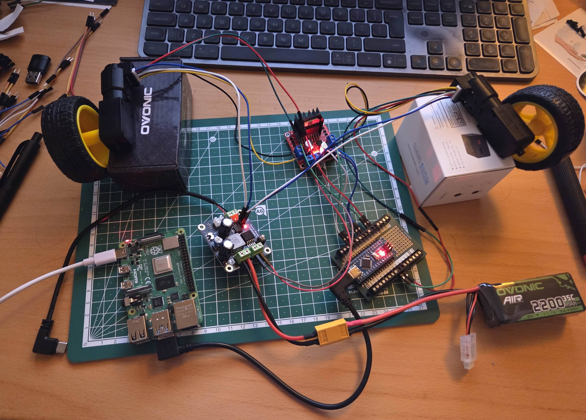

# Step 3: Add Raspberry Pi

This step adds the computing brain of the robot - a Raspberry Pi running Ubuntu Server and ROS2 Humble. The Raspberry Pi will communicate with the Arduino over serial to control the motors.



**Note**: The image shows the DFRobot DFR0205 pins 3 and 4 can be connected to USB-C for charging/powering the Raspberry Pi.

## Hardware Components

### New Parts

1. **Raspberry Pi** (4, or 5 recommended)
2. **MicroSD Card** (32GB or larger, Class 10 or better)
3. **USB Cable** (to connect Arduino to Raspberry Pi)
4. **USB-C Cable** (to power Raspberry Pi from DFR0205 pins 3 and 4)

## Software Setup

### 1. Install Ubuntu Server 22.04

Download and install Ubuntu Server 22.04 LTS on your Raspberry Pi:

**Download**: [Ubuntu Server 22.04 for Raspberry Pi](https://ubuntu.com/download/raspberry-pi)

**Installation Steps**:

1. Download Raspberry Pi Imager: https://www.raspberrypi.com/software/
2. Select "Ubuntu Server 22.04 LTS (64-bit)" as the OS
3. Select your microSD card
4. Configure settings (hostname, WiFi, SSH) before writing
5. Write the image to the SD card
6. Insert SD card into Raspberry Pi and boot

**First Boot**:

```bash
# SSH into your Raspberry Pi (default user: ubuntu, password: ubuntu)
ssh ubuntu@<raspberry-pi-ip>

# Update system
sudo apt update
sudo apt upgrade -y
```

### 2. Install ROS2 Humble

Follow the official ROS2 Humble installation guide for setting up sources, then install ROS2 packages:

**Setup ROS2 Sources** (follow [official guide](https://docs.ros.org/en/humble/Installation/Ubuntu-Install-Debians.html)):

```bash
# Set locale
sudo apt install locales
sudo locale-gen en_US en_US.UTF-8
sudo update-locale LC_ALL=en_US.UTF-8 LANG=en_US.UTF-8
export LANG=en_US.UTF-8

# Setup sources
sudo apt install software-properties-common
sudo add-apt-repository universe
sudo apt update && sudo apt install curl -y
sudo curl -sSL https://raw.githubusercontent.com/ros/rosdistro/master/ros.key -o /usr/share/keyrings/ros-archive-keyring.gpg
echo "deb [arch=$(dpkg --print-architecture) signed-by=/usr/share/keyrings/ros-archive-keyring.gpg] http://packages.ros.org/ros2/ubuntu $(. /etc/os-release && echo $UBUNTU_CODENAME) main" | sudo tee /etc/apt/sources.list.d/ros2.list > /dev/null
```

**Install ROS2 Packages**:

```bash
# Update and upgrade system
sudo apt update
sudo apt upgrade

# Install ROS2 Humble base and useful packages
sudo apt install ros-humble-ros-base ros-humble-demo-nodes-cpp ros-humble-teleop-twist-keyboard ros-humble-rmw-cyclonedds-cpp ros-humble-joint-state-publisher

# Install development tools
sudo apt update && sudo apt install ros-dev-tools git-all
```

### 3. Configure ROS2 Environment

Add ROS2 to your `.bashrc` so it loads automatically on startup:

```bash
# Edit .bashrc
nano ~/.bashrc
```

Add this line at the end of the file:

```bash
### ROS2 Humble Setup
source /opt/ros/humble/setup.bash
```

Save and exit (Ctrl+X, then Y, then Enter).

Apply the changes:

```bash
source ~/.bashrc
```

### 4. Verify ROS2 Installation

Test that ROS2 is working:

```bash
# Check ROS2 version
ros2 --version

# Test with a simple talker/listener
# Terminal 1:
ros2 run demo_nodes_cpp talker

# Terminal 2 (new SSH session):
ros2 run demo_nodes_cpp listener
```

If you see messages being published and received, ROS2 is working correctly!

## Hardware Connection

### Connect Arduino to Raspberry Pi

1. Connect Arduino to Raspberry Pi via USB cable

2. Check the serial port:

```bash
# List USB devices
ls /dev/ttyUSB* /dev/ttyACM*

# You should see something like /dev/ttyACM0 or /dev/ttyUSB0
```

3. Add your user to the dialout group for serial access:

```bash
sudo usermod -a -G dialout $USER

# Log out and log back in for changes to take effect
```

4. Create udev rule for consistent device naming:

First, find the Arduino's unique identifiers:

```bash
# Get device info
udevadm info -a -n /dev/ttyACM0 | grep '{idVendor}\|{idProduct}\|{serial}'
```

Create a udev rule file:

```bash
sudo nano /etc/udev/rules.d/99-arduino.rules
```

Add this line (adjust idVendor and idProduct based on your Arduino):

```
SUBSYSTEM=="tty", ATTRS{idVendor}=="1a86", ATTRS{idProduct}=="7523", SYMLINK+="arduino_nano"
```

Reload udev rules:

```bash
sudo udevadm control --reload-rules
sudo udevadm trigger
```

Now you can access the Arduino as `/dev/arduino_nano` instead of `/dev/ttyACM0`!

## Testing

### Test Serial Communication

You can test the Arduino connection from the Raspberry Pi:

```bash
# Install screen for serial communication
sudo apt install screen -y

# Connect to Arduino using the friendly name
screen /dev/arduino_nano 57600
```

Try the same test commands from Step 1:

- `e` - Read encoder values
- `o 100 100` - Move motors (open loop)
- `m 100 100` - Move motors (closed loop)

Press `Ctrl+A` then `K` to exit screen.

## Next Steps

With the Raspberry Pi running ROS2 and connected to the Arduino, you're ready to:

1. **Clone this repository** into your ROS2 workspace:

   ```bash
   mkdir -p ~/ros2_ws/src
   cd ~/ros2_ws/src
   git clone https://github.com/legalaspro/fastbot_ros2.git fastbot_ros2
   cd ~/ros2_ws
   colcon build --symlink-install
   source install/setup.bash
   ```

2. **Use ROS2 motor control** - The `serial_motor` and `serial_motor_msgs` packages provide ROS2 integration for sending `cmd_vel` commands to the Arduino. See [ROS2 Motor Control Guide](ros2_motor_control.md) for details.

3. **Add sensors** - Integrate LiDAR, IMU, cameras, etc.

## Resources

- [Ubuntu Server for Raspberry Pi](https://ubuntu.com/download/raspberry-pi)
- [ROS2 Humble Documentation](https://docs.ros.org/en/humble/)
- [ROS2 Installation Guide](https://docs.ros.org/en/humble/Installation/Ubuntu-Install-Debians.html)
