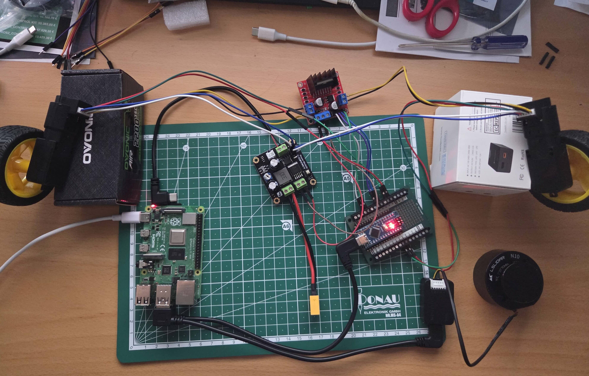

# Step 4: Add LSlidar N10

This step adds a LiDAR sensor for obstacle detection and mapping. The LSlidar N10 provides 360-degree laser scanning for navigation and SLAM applications.



## Hardware Components

### New Parts

1. **LSlidar N10** - 2D LiDAR sensor

   - 360° scanning range
   - 12m detection range
   - 10Hz scan rate
   - Ethernet interface
   - [Product Link](https://www.lslidar.com/product/n10-navigation-obstacle-avoidance-lidar/)

2. **USB-C to LiDAR Connector Cable** - To connect LiDAR to Raspberry Pi (comes with LSlidar N10)

## Hardware Connection

### Connect LiDAR to Raspberry Pi

1. **Connect via USB-C**:

   - Connect the USB-C to LiDAR connector cable from Raspberry Pi to the LiDAR
   - The cable provides both power and data communication (Ethernet over USB-C)
   - The LSlidar N10 is small and draws power directly from the Raspberry Pi - no separate power supply needed

That's it! The network configuration is already handled by the pre-configured driver package.

## Software Setup

### Use Pre-configured Driver

This repository includes the `Lslidar_ROS2_driver` package pre-configured for the LSlidar N10.

1. **Install required dependencies**:

   The LiDAR driver requires additional libraries to build:

   ```bash
   sudo apt update && sudo apt install -y \
       libboost-all-dev \
       libpcl-dev \
       libpcap-dev \
       ros-humble-diagnostic-updater \
       ros-humble-pcl-conversions
   ```

2. **Build the workspace** (if not already done):

   ```bash
   cd ~/ros2_ws
   colcon build --symlink-install
   source install/setup.bash
   ```

3. **Launch the LiDAR driver**:

   ```bash
   ros2 launch lslidar_driver lslidar_launch.py
   ```

   The driver will:

   - Connect to the LiDAR via serial interface (`/dev/lslidar`)
   - Publish laser scan data to `/fastbot/scan` topic (when launched via bringup)
   - Configuration is pre-set in `lsx10.yaml` for N10 LiDAR

## Testing

### Verify LiDAR Data

Check that the LiDAR is publishing data:

```bash
# List topics
ros2 topic list

# When launched standalone:
# /scan

# When launched via bringup:
# /fastbot/scan

# Echo scan data (adjust topic name based on launch method)
ros2 topic echo /fastbot/scan

# Check scan rate
ros2 topic hz /fastbot/scan
```

## Configuration

The LiDAR driver configuration is pre-configured in `Lslidar_ROS2_driver/lslidar_driver/params/lsx10.yaml`:

- **lidar_name**: N10
- **interface_selection**: serial
- **serial*port***: /dev/lslidar
- **frame_id**: laser_link (overridden by launch argument)
- **scan_topic**: /scan (overridden to `/fastbot/scan` by bringup launch)
- **min_range**: 0.02m
- **max_range**: 12.0m
- **pubScan**: true (publishes scan topic)
- **pubPointCloud2**: false (point cloud disabled by default)

All settings are optimized for the N10 LiDAR and ready to use!

**Note**: When using `fastbot_bringup`, the `frame_id` is set to `fastbot_lslidar_n10` and `scan_topic` is set to `/fastbot/scan` to match the robot's namespace and TF tree.

## Resources

- [LSlidar N10 Product Page](https://www.lslidar.com/product/n10-navigation-obstacle-avoidance-lidar/)
- [ROS2 sensor_msgs/LaserScan](https://docs.ros2.org/latest/api/sensor_msgs/msg/LaserScan.html)
- [RViz2 User Guide](https://github.com/ros2/rviz)
