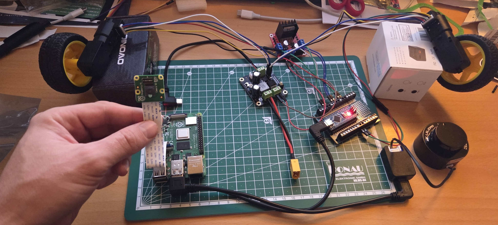

# Step 5: Add Raspberry Pi Camera

This step adds a Raspberry Pi camera module for vision capabilities using ROS2.



## Hardware Components

### New Parts

1. **Raspberry Pi Camera Module** (v1, v2, or HQ camera)
   - CSI ribbon cable connection
   - Compatible with Raspberry Pi camera connector

## Hardware Connection

1. **Connect the camera**:
   - Locate the CSI camera connector on the Raspberry Pi (between HDMI and USB ports)
   - Gently pull up the plastic clip
   - Insert the ribbon cable with contacts facing away from the HDMI port
   - Push the plastic clip back down to secure the cable

## Software Setup

### 1. Enable Legacy Camera Driver

Since 2020, Raspberry Pi moved to a camera stack based on libcamera (bcm2835-unicam). This stack is not compatible with ros2_v4l2_camera - we need to change it to the legacy bcm2835 mmal driver.

Edit the boot configuration file:

```bash
sudo nano /boot/firmware/config.txt
```

Make the following changes:

1. Set `camera_autodetect=0` to prevent hardware overlays that use the unicam driver from being loaded
2. At the end of the file, add `start_x=1` to enable the camera using the legacy driver

The relevant section should look like this:

```
camera_autodetect=0

# Enable camera (legacy driver)
start_x=1
```

Save and reboot:

```bash
sudo reboot
```

### 2. Verify Camera Detection

After reboot, check that the camera is detected:

```bash
# Check for video device
ls /dev/video*

# You should see /dev/video0
```

### 3. Install ros2_v4l2_camera

The ros2_v4l2_camera package is available from the official repository: [https://gitlab.com/boldhearts/ros2_v4l2_camera](https://gitlab.com/boldhearts/ros2_v4l2_camera)

Install the camera packages from apt:

```bash
sudo apt install ros-humble-v4l2-camera ros-humble-image-transport-plugins v4l-utils
```

### 4. Launch Camera Node

Launch the camera node:

```bash
ros2 run v4l2_camera v4l2_camera_node
```

Or with custom parameters:

```bash
ros2 run v4l2_camera v4l2_camera_node --ros-args -p image_size:="[640,480]" -p camera_frame_id:=camera_link
```

## Testing

### Verify Camera Topics

Check that the camera is publishing images:

```bash
# List topics
ros2 topic list

# When launched standalone:
# /camera_info
# /image_raw
# /image_raw/compressed

# When launched via bringup (namespaced as fastbot_camera):
# /fastbot_camera/camera_info
# /fastbot_camera/image_raw
# /fastbot_camera/image_raw/compressed

# Check image publishing rate (adjust topic based on launch method)
ros2 topic hz /fastbot_camera/image_raw

# Echo camera info
ros2 topic echo /fastbot_camera/camera_info
```

## Configuration

Common parameters for the v4l2_camera node:

- **video_device**: Device path (default: `/dev/video0`)
- **image_size**: Resolution as `[width, height]` (e.g., `[640, 480]`)
- **camera_frame_id**: TF frame for the camera (default: `camera`)
- **pixel_format**: Pixel format (e.g., `YUYV`, `MJPEG`)
- **framerate**: Frames per second (default: 30)

## Resources

- [ros2_v4l2_camera GitLab Repository](https://gitlab.com/boldhearts/ros2_v4l2_camera)
- [Raspberry Pi Camera Documentation](https://www.raspberrypi.com/documentation/accessories/camera.html)
- [ROS2 image_transport](https://github.com/ros-perception/image_common)
