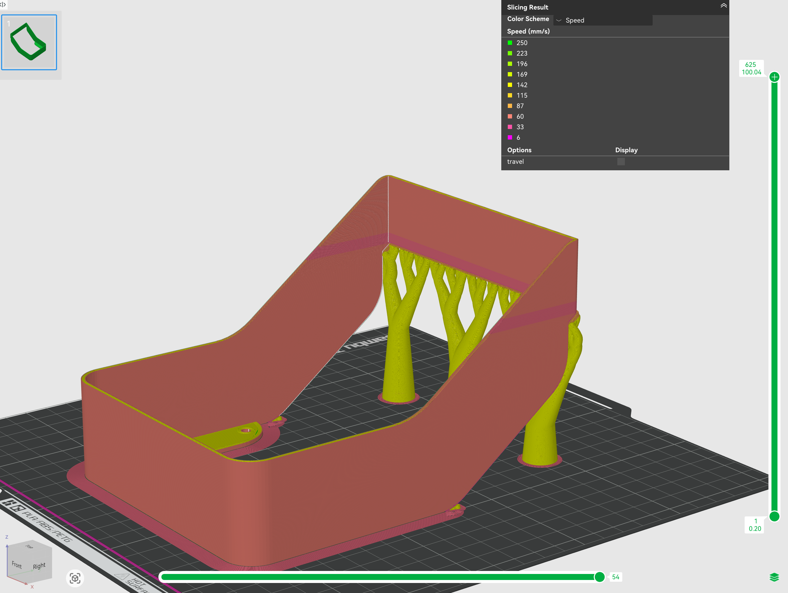

# Fastbot Cover

Optional decorative cover for the Fastbot robot.

## OnShape Design

**[Robot Cover Design](https://cad.onshape.com/documents/0a34668587f2e2da42d17d97/w/df32b6bb6912ecfe0c0a09c3/e/38b8184e23d323bb4ac25551)**

## 3D Printing

### Files

- `robot-cover-1.1.3mf` - Bambu Lab project file (ready to print)

### Print Settings

Recommended settings for Bambu Lab printers:

- **Material**: PLA
- **Layer Height**: 0.16mm
- **Infill**: 15-20%
- **Supports**: Check the 3MF file for pre-configured supports
- **Print Time**: Varies by printer model

#### Print Speed Adjustments

For better quality on overhanging layers, the print speed has been reduced on the first 3-4mm of layer height over the long ~12cm overhanging section:

**Recommended speed for overhangs**: 50 mm/s or lower

This slower speed improves print quality and reduces the risk of layer sagging on the longer overhanging sections of the cover.

### Installation

The cover is designed to fit over the Fastbot chassis. It's purely decorative and not required for robot operation.

## Notes

This cover is optional and does not need to be integrated into the URDF model unless desired for visualization purposes.
