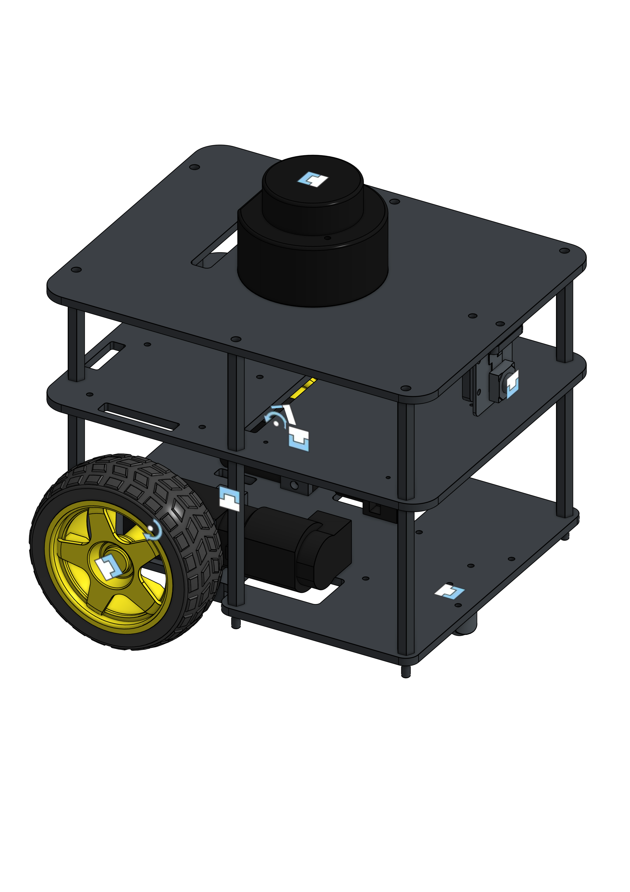
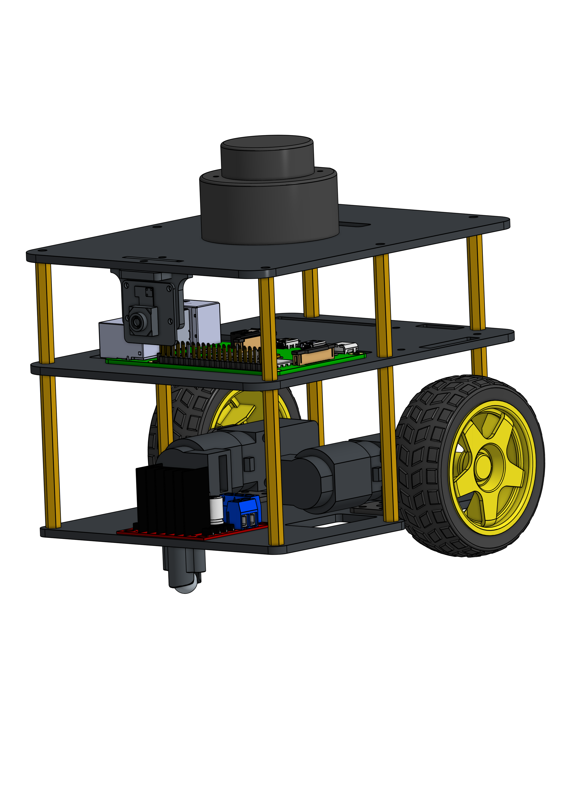

# Fastbot Description

This package contains the URDF/Xacro robot description files and 3D models for the Fastbot mobile robot platform.

## OnShape CAD Models

### Simplified Version (Used in ROS2)

We use a simplified version of the Fastbot design for the ROS2 URDF model:

**[Simplified Fastbot Model](https://cad.onshape.com/documents/8a7a4f7feddc94d149095e62/w/869d6d24aab8a7e0d7008d76/e/499ce0f55b04e515a388f757?renderMode=0&uiState=69492a51fc4dcf74e7227cb8)**



This simplified model is optimized for simulation and contains the essential components needed for robot control and visualization.

### Full Design (Main Work)

The complete and detailed Fastbot design with all mechanical components:

**[Full Fastbot Design](https://cad.onshape.com/documents/b0b371ba1d3a5a7dc9377afc/w/c05bdd60c2cf92ba7ce8d44b/e/d3e2768fac589891cdd620be)**



This is the main design document containing all the detailed mechanical work, assemblies, and manufacturing specifications.

## Contents

- **launch/**: Launch files including robot_state_publisher
- **models/**: URDF/Xacro robot description files
- **onshape/**: OnShape integration files and exported meshes

## Usage

Launch the robot state publisher:

```bash
ros2 launch fastbot_description robot_state_publisher.launch.py
```

This will publish the robot's URDF description and transform tree (TF) based on joint states.

## License

MIT License - See the main repository LICENSE file for details.
